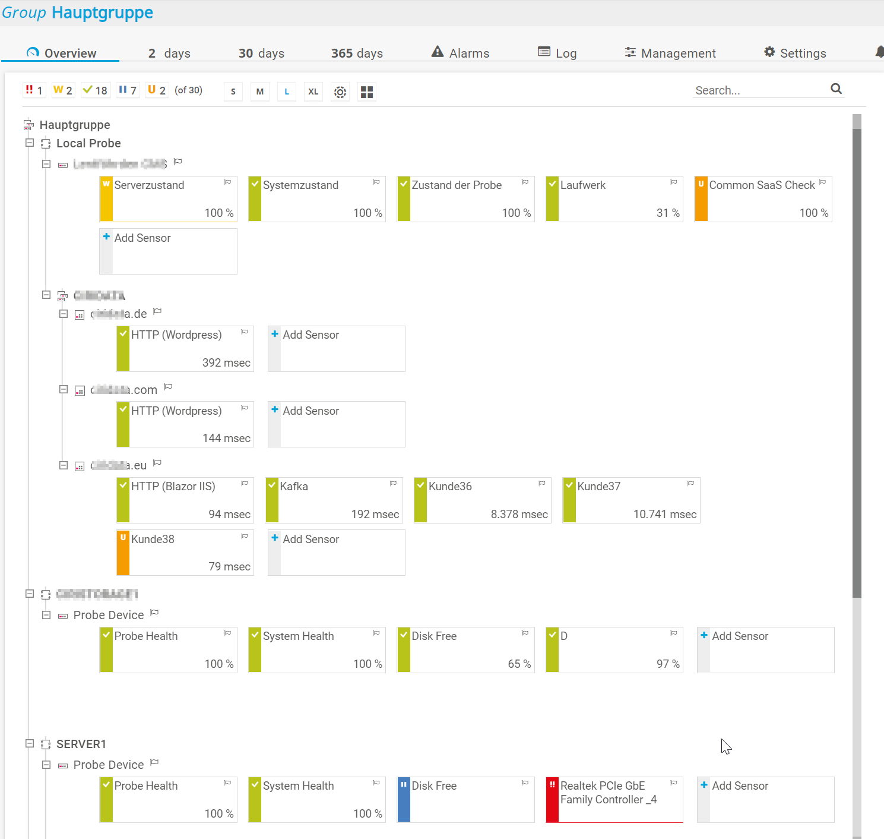
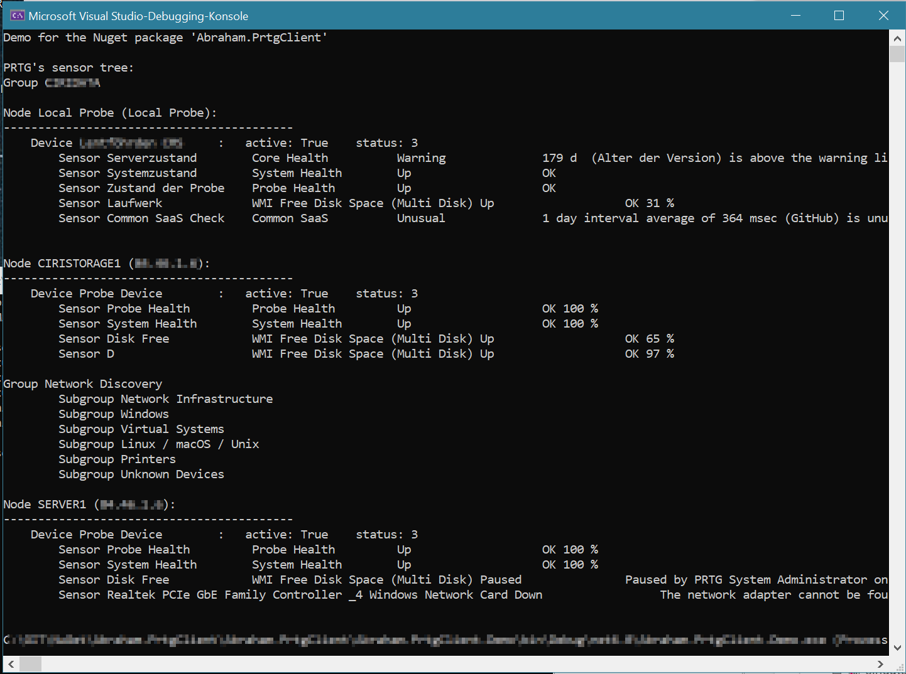

# Abraham.PrtgClient

## OVERVIEW

Connects to a PRTG server and read the sensor tree, including the sensor values.
You can use this Nuget package to read out sensor values, for example to build a custom dashboard.
The Load method reads the complete sensor tree.
You'll find all sensors there.
Please take a look at my example to find out how the sensors are located in the tree.
For example, please refer to the demo project on github. 


## LICENSE

Licensed under Apache licence.
https://www.apache.org/licenses/LICENSE-2.0


## Compatibility

The nuget package was build with DotNET 6.


## INSTALLATION

Install the Nuget package "Abraham.PrtgClient" into your application (from https://www.nuget.org).

Add the following code:
```C#
    var client = new PrtgClient()
        .UseURL(_serverURL)
        .UsePasshashAuthentication(_username, _password)
        .UseConnectionTimeout(60);

    client.GetSensorTree().GetAwaiter().GetResult();

    // now access the elements of client.SensorTree
    // please refer to the demo.
```


That's it!

For more options, please refer to my Demo application in the github repository (see below).
The Demo and the nuget source code is well documented.


## HOW TO INSTALL A NUGET PACKAGE
This is very simple:
- Start Visual Studio (with NuGet installed) 
- Right-click on your project's References and choose "Manage NuGet Packages..."
- Choose Online category from the left
- Enter the name of the nuget package to the top right search and hit enter
- Choose your package from search results and hit install
- Done!


or from NuGet Command-Line:

    Install-Package Abraham.PrtgClient


## ABOUT THE PRTG API

The API documentation can be found at
https://www.paessler.com/manuals/prtg/application_programming_interface_api_definition

## NOTE ABOUT THE AUTHENTICATION

The demo uses the passhash authentication.
This is not best practise, because the credentials are passed through the request URL.
For production, better create an API token and use the apitoken authentication.


## AUTHOR

Oliver Abraham, mail@oliver-abraham.de, https://www.oliver-abraham.de

Please feel free to comment and suggest improvements!


## SOURCE CODE

The source code is hosted at:

https://github.com/OliverAbraham/Abraham.PrtgClient

The Nuget Package is hosted at: 

https://www.nuget.org/packages/Abraham.PrtgClient


## SCREENSHOTS

Based on this example PRTG infrastructure:


the demo project will read out the sensor tree like this:



# MAKE A DONATION !

If you find this application useful, buy me a coffee!
I would appreciate a small donation on https://www.buymeacoffee.com
